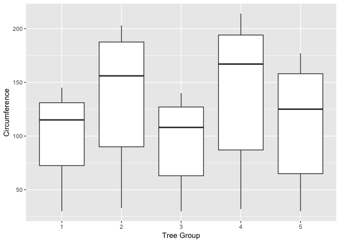

# Third Question
Maryam Shahini, Ramin Farhanian  
8/9/2017  


##Question 03 (20 points)

The built-in data set called Orange in R is about the growth of orange trees. The Orange data frame has 3 columns of records of the growth of orange trees.

Variable description
Tree : an ordered factor indicating the tree on which the measurement is made. The ordering 
            is according to increasing maximum diameter.

age :  a numeric vector giving the age of the tree (days since 1968/12/31)
circumference :  a numeric vector of trunk circumferences (mm). This is probably   
                           “circumference at breast height”, a standard measurement in forestry.

Library installation on demand

```r
installLibrariesOnDemand <- function (packages)
{
  cat("Installing required libraries on demand:", packages , "\n")
  new.packages <- packages[!(packages %in% installed.packages()[,"Package"])]
  if(length(new.packages)) install.packages(new.packages)
  cat("Missing libraries installation is complete.", "\n")
}
installLibrariesOnDemand(c("ggplot2"))
```

```
## Installing required libraries on demand: ggplot2 
## Missing libraries installation is complete.
```

```r
library(ggplot2)

data("Orange")
```

Calculate the mean and the median of the trunk circumferences for different size of the trees. (Tree)


```r
means <-tapply(Orange$circumference, Orange$Tree, FUN=mean)
print(means)
```

```
##         3         1         5         2         4 
##  94.00000  99.57143 111.14286 135.28571 139.28571
```

```r
medians<- tapply(Orange$circumference, Orange$Tree, FUN=median)
print(medians)
```

```
##   3   1   5   2   4 
## 108 115 125 156 167
```

Make a scatter plot of the trunk circumferences against the age of the tree. Use different plotting symbols for different size of trees. (Tree)


```r
scatterPlot <- ggplot(Orange,aes(Orange$circumference, Orange$age, color= Orange$Tree, shape= Orange$Tree)) + 
  geom_point() + labs(x = "Circumference") + labs(y = "Age") + labs(shape = "Tree Group")  + labs(color = "Tree Group") +
 labs(title = "Trunk circumferences vs. age of the tree")
print(scatterPlot)
```

<!-- -->

Display the trunk circumferences on a comparative boxplot against tree. Be sure you order the boxplots in the increasing order of maximum diameter.


```r
Orange$Tree <- factor(Orange$Tree, levels = as.integer(Orange$Tree[order(Orange$Tree)]))
```

```
## Warning in `levels<-`(`*tmp*`, value = if (nl == nL) as.character(labels)
## else paste0(labels, : duplicated levels in factors are deprecated
```

```r
box <- ggplot(Orange, aes( Orange$Tree, Orange$circumference)) + geom_boxplot() + labs(y = "Circumference") + labs(x = "Tree Group")
print(box)
```

```
## Warning in `levels<-`(`*tmp*`, value = if (nl == nL) as.character(labels)
## else paste0(labels, : duplicated levels in factors are deprecated

## Warning in `levels<-`(`*tmp*`, value = if (nl == nL) as.character(labels)
## else paste0(labels, : duplicated levels in factors are deprecated
```

<!-- -->
